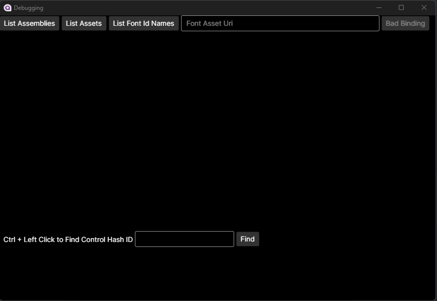
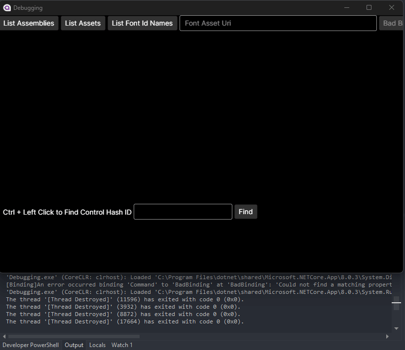

Collection of small debugging improvements over what's available in DevTools. It is necessary to add these into your own app, there's no attachment like DevTools. Most functionality is in 
the DebugPlus folder.

## App Binary Diagnostics

* Assembly Listing
* Asset Listing
* Font Name IDs Listing

Knowing what binaries your app relies upon is important. This demonstrates how to list all assemblies and assets for the current app while it is running.

Fonts have long been a confusing part of XAML as the rules are a bit different. The filename has no effect on the Uri that needs to be referenced. The key name is created from 
the Typographic Family Name (or fallback to Font Family Name if none available) which are two fields within the Name IDs section. This feature predicts what the full Uri 
should be by reading the Name IDs from a font included as an asset and provides the XAML necessary to create a `FontFamily`.

[FontDrop](https://fontdrop.info/#/?darkmode=true) and [msdocs](https://learn.microsoft.com/en-us/typography/opentype/spec/name#name-ids) were helpful in the font area.



## Improved Locating for Bad Bindings

* Customized ILogSink with Visual Tree Information
* Lookup Control via Hash ID

Locating the source of bad bindings has been a long-running problem, mitigated by use of compiled bindings more recently. However, it's still occasionally an issue. Avalonia logs 
these binding errors and prints out the Hash ID when the Control containing the bad binding doesn't have a name. `DebugPlusLogSink` changes this so that all events will 
log the Hash ID, Name (if available), and the Visual Tree hierarchy.

When you have the Control Hash ID, you can locate the actual Control by searching the Visual Tree. The capture below demonstrates this.



The logged message is:
```
[Binding]An error occurred binding 'Command' to 'BadBinding' at 'BadBinding': 'Could not find a matching property accessor for 'BadBinding' on 'Debugging.ViewModels.MainWindowViewModel'.' (Button #36936550 #badButton Visual Tree: Grid -> StackPanel -> Button)
```
