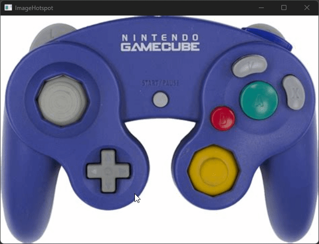
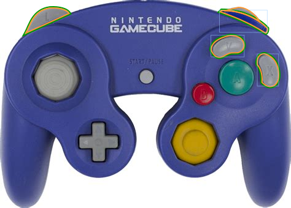



ImageHotspot demonstrates how to build interactive buttons onto a fixed size raster image.

## Problems and approach used:

### Image must be scalable while maintaining Button locations

A Canvas matching the size of the Image is used. The Canvas contains the Image as well as all Buttons which are placed using absolute Canvas coordinates. An external image editor was used to manually determine coordinates and dimensions of the Buttons.

Viewbox is used to scale the Canvas to the full window size.

### Interactive Buttons can be of arbitrary shape

Ellipse and Rectangle are used for simpler shapes. Path is used as the Button child to define a shape that can have a outline and fill.

Inkscape was used to trace paths around the non-square, non-circular elements. One difficulty is that in Avalonia, the Buttons are translated in the Canvas. This means that child content inherits the Button position and not the Image. In Inkscape, you can fake this by applying an SVG transform such that the SVG Path is relative to (0, 0) after tracing.

### Button hitboxes and outline should match the arbitrary shape

Button.Clip allows setting of a Geometry to clip rendering and hit testing. For circular elements, EllipseGeometry is used. For Path-based elements, Inkscape was used to create an offset Path from the original, about 2px, which was set as a PathGeometry. This allowed the outline to be drawn without partial clipping.

## Alternative approaches

Inkscape can create SVGs with images. It should be possible to draw paths, save as SVG, and load the SVG to create paths and visual elements from information within the SVG. Likely the better approach if you were making a stadium seating chart interactive with potentially hundreds of hotspots.

## Resources

For tips on tracing into vector graphics, read [So What's the Big Deal with Horizontal & Vertical Bezier Handles Anyway?](https://www.photoshopfaceoff.com/design-tutorials/so-what-s-the-big-deal-with-horizontal-vertical-bezier-handles-anyway.html)

The controller SVG is provided for examination. Only the arbitrary shapes were drawn. The rest were determined by a traditional raster image editor.
