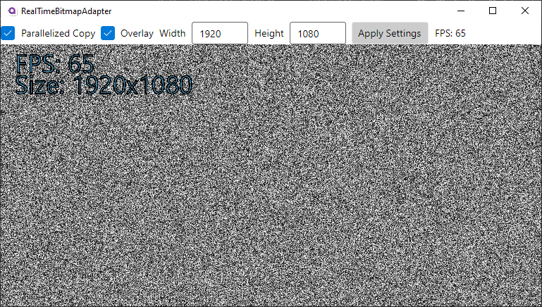



Demonstrates how to create a domain-specific image type that is updated in realtime and how to adapt it into a 
type (`WriteableBitmap`) that Avalonia can render.

In specific, a domain-specific image type (`ColorScaleImage`) is updated every frame with pixel values between [0-1] with some 
"domain logic" that is fully isolated from the View. For this app, it is a random value but it could be heatmap data in 
a real application. Then the pixel data is mapped greyscale RGB, copied into a `WriteableBitmap`, and the `Image.Source` referencing 
it has `Image.InvalidateVisual` called so Avalonia is aware it must re-render an updated image. This results in an image that looks 
like uniform white noise.

This demo also serves as a rough upper-bounds estimate of performance for `WriteableBitmap` though performance will ultimately be 
improved if logic/rendering is done directly to the `WriteableBitmap` without the domain-specific indirection.

Finally, the image adapters in the project are a good example of image type conversions. Useful because Avalonia doesn't directly 
render third-party library image types such as those from `ImageSharp` or `ImageMagick`. For best performance, it should be better to 
wrap `SKBitmap` around the image type's pixel buffer via `SKBitmap.SetPixels`, if possible, to avoid copies. It was not possible for this demo.